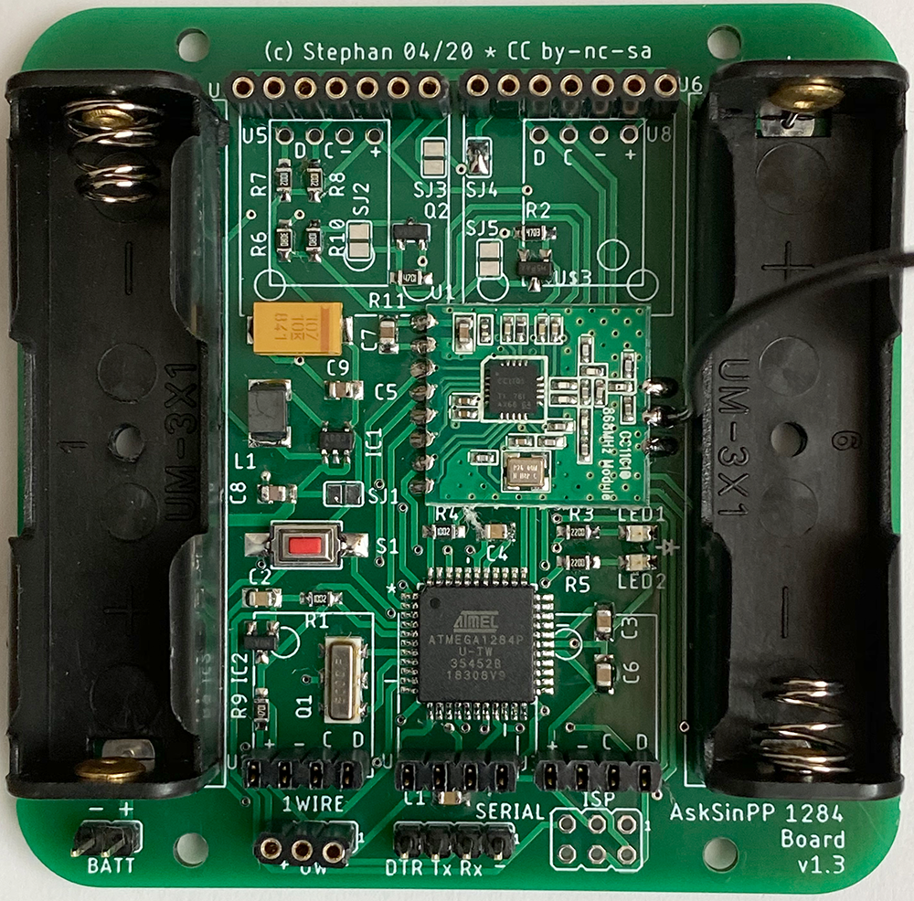
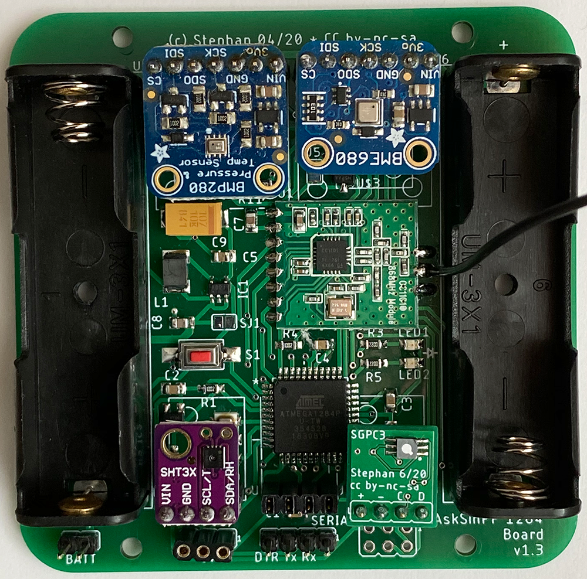

# AskSinPP 1284 Board

Ein universelles Sensor-Board fuer Projekte mit der AskSinPP Library mit einem ATMega1284P, wenn der Flash oder RAM des ATMega328P nicht mehr ausreicht. Das Board ist fuer Handloetung ausgelegt und passt in das [Camdenboss-Sensor-Wandgehaeuse CBRS01VWH](https://www.camdenboss.com/camden-boss/cbrs01vwh-room-sensor-enclosure%2c-size-1%2c-vented%2c-white%2c-86x86x25.5mm/c-23/p-23038).

Die Gerber-Files werden bspw. von [JLCPCB](https://jlcpcb.com/) anstandslos verarbeitet.

#### Prototyp

#### Features

- 5 Steckplaetze fuer I2C-Sensor-Breakout-Boards, 2 davon wahlweise fuer siebenpolige Adafruit-Boards
- 2x AA-Batterie on Board
- optional MAX1724 Wandler zum "Ausquetschen" der Batterien
- optional Babbling Idiot Protection mittels MCP111 Brownout-Überwachung und Abschaltung der CC1101-Versorgungspsannung
- Header fuer Serial, ISP, Betriebsspannung, OneWire

#### Bauteile

- CC1101 868MHz Modul (div. Versender)
- Batteriehalter Goobay 48677
- Wandlerelko 100uF/10V Kemet T494 Serie (Low ESR)
- Speicherdrossel 10uH Murata LQH43CN100K03L
- Resonator Murata CSTCC 8MHz (EOL, aber noch gut erhaeltlich und gut zu loeten)
- Taster SMD 3x6x2.5mm (div. Versender)
- restliche Bauteile gemaess Schaltplan: Standard 0805

#### Credits

Viele gute Ideen sind von [Tom Major](https://github.com/TomMajor/SmartHome) uebernommen, insb. die BI-Protection und der Stepup-Wandler.

#### Lizenz

Creative Commons BY-NC-SA
