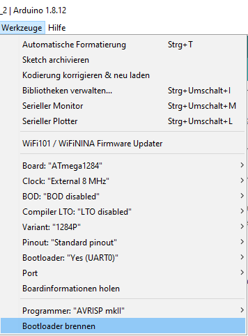
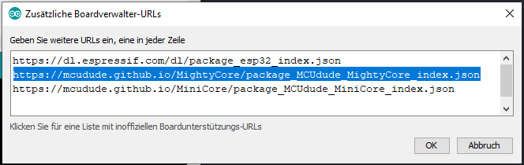

# AskSinPP 1284 Board

Ein universelles Sensor-Board fuer Projekte mit der AskSinPP Library mit einem ATMega1284P, wenn der Flash oder RAM des ATMega328P nicht mehr ausreicht. Das Board ist fuer Handloetung ausgelegt und passt in das [Camdenboss-Sensor-Wandgehaeuse CBRS01VWH](https://www.camdenboss.com/camden-boss/cbrs01vwh-room-sensor-enclosure%2c-size-1%2c-vented%2c-white%2c-86x86x25.5mm/c-23/p-23038).

Die Gerber-Files werden bspw. von [JLCPCB](https://jlcpcb.com/) anstandslos verarbeitet.

## Prototyp

### Vollstaendig mit allen Optionen bestueckte Platine

### Platine in Aktion als Testdevice BME680 vs. alternative Sensoren

## Features

- 5 Steckplaetze fuer I2C-Sensor-Breakout-Boards, 2 davon wahlweise fuer siebenpolige Adafruit-Boards
- Header fuer Serial, ISP, Betriebsspannung, OneWire
- 2x AA-Batterie on Board
- optional MAX1724 Wandler zum "Ausquetschen" der Batterien
- optional Babbling Idiot Protection mittels MCP111 Brownout-Überwachung und Abschaltung der CC1101-Versorgungspsannung

## Bauteile

- CC1101 868MHz Modul (div. Versender)
- Batteriehalter Goobay 48677
- Wandlerelko 100uF/10V Kemet T494 Serie (Low ESR)
- Speicherdrossel 10uH Murata LQH43CN100K03L
- Resonator Murata CSTCC 8MHz (EOL, aber noch gut erhaeltlich und gut zu loeten)
- Taster SMD 3x6x2.5mm (div. Versender)
- restliche Bauteile gemaess Schaltplan: Standard 0805

## Bestueckungsvarianten

1. Step-Up-Wandler: Entweder IC1, L1, C8, C5, C9 bestuecken oder Lötjumper SJ1 schliessen
2. Externe Brownout-Detection als Babbling Idiot Protection: Entweder MCP111 bestuecken oder ersatzlos weglassen
3. Abschaltung CC1101-Versorgung bei Reset des Controllers als erweiterte BI-Protection: Entweder U3 und R2 bestuecken oder SJ5 schliessen
3. Batteriespannungsmessung mit/ohne echte Last: Entweder Q2 und R11 bestuecken oder SJ2 schliessen und R6=470k sowie R10=100k bestuecken
4. alternative I2C-Adresse fuer bestimmte Adafruit-Module einstellen: SJ3 bzw SJ4 schliessen

## Softwareeinbindung

Zunaechst sollte nach Auswahl und Config des 1284p ein passender Bootloader wie der MightyCore geflasht werden. Die Config in der Arduino-IDE sieht wie folgt aus:
.
Falls noch nicht geschehen, muss  vorab in der Arduino IDE unter Voreinstellungen, zusaetzliche Boardverwalter-URLs, einmalig der Pfad hinterlegt werden, damit der 1284 auswaehlbar ist:
.

Im Sketch sind dann die passenden Pinzuordnungen vorzunehmen:

  #define CC1101_CS_PIN       4
  #define CC1101_GDO0_PIN     2
  #define CC1101_SCK_PIN      7
  #define CC1101_MOSI_PIN     5
  #define CC1101_MISO_PIN     6
  #define LED_PIN             14   //LEDs on PD6 (Arduino Pin 14) and PD7 (Arduino Pin 15)
  #define LED_PIN2            15
  #define CONFIG_BUTTON_PIN   13
  #define CC1101_PWR_SW_PIN   27

Wird die Abschaltung der CC1101-Versorgungsspannung mittels U3 genutzt, ist das Gate im Setup des Sketch Low zu ziehen:

  pinMode(CC1101_PWR_SW_PIN, OUTPUT);
  digitalWrite (CC1101_PWR_SW_PIN, LOW);  

Man erkauft sich den zusaetzlichen BI-Schutz also durch einen erhoehten Ruhestrom durch R2. Da ein offenes Gate gelegentlich unerwuenschte Effekte produziert, ist die Bestueckung dieses Widerstandes jedoch zu empfehlen und 470k als vernuenftiger Kompromiss anzusehen.

## Credits

Viele gute Ideen sind von [Tom Major](https://github.com/TomMajor/SmartHome) uebernommen, insb. die BI-Protection und der Step-Up-Wandler.

## Lizenz

Creative Commons BY-NC-SA
