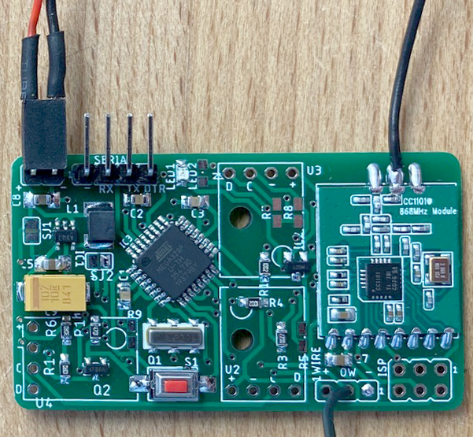

# AskSinPP Universal Board

Ein universelles Sensor-Board fuer Projekte mit der AskSinPP Library mit einem ATMega328P. Das Board ist fuer Handloetung ausgelegt und passt in das [Gainta G201 Gehaeuse](http://www.gainta.com/de/g201.html).

Die Gerber-Files werden bspw. von [JLCPCB](https://jlcpcb.com/) anstandslos verarbeitet.


## Prototyp

Hier eine Bestueckung mit den Optionen 1 - 3 unten, jedoch ohne Pinleisten fuer die I2C-Breakout-Boards und Pullups fuer die I2C-Leitungen sowie ohne R5, da der OneWire-Anschluss hier als Zaehlereingang fuer meinen Regenmesser genutzt wird.




## Features

- 3 Steckplaetze fuer I2C-Sensor-Breakout-Boards mit je 4 Pins
- Header fuer Serial, ISP, Betriebsspannung, OneWire bzw. anderweitige Verwendung als Zaehlereingang etc.
- 2x AA-Batteriefach unter dem Board mit zwei Schrauben montierbar
- optional MAX1724 Wandler zum "Ausquetschen" der Batterien
- optional Babbling Idiot Protection mittels MCP111 Brownout-Überwachung


## Bauteile

- CC1101 868MHz Modul (div. Versender)
- Wandlerelko 100uF/10V Kemet T494 Serie (Low ESR)
- Speicherdrossel 10uH Murata LQH43CN100K03L
- Resonator Murata CSTCC 8MHz (EOL, aber noch gut erhaeltlich und gut zu loeten)
- Taster SMD 3x6x2.5mm (div. Versender)
- restliche Bauteile gemaess Schaltplan: Standard 0805


## Bestueckungsvarianten

1. Step-Up-Wandler: Entweder IC1, L1, C8, C5, C9 bestuecken oder Lötjumper SJ1 schliessen
2. Externe Brownout-Detection als Babbling Idiot Protection: Entweder MCP111 bestuecken oder ersatzlos weglassen
3. Batteriespannungsmessung mit/ohne echte Last: Entweder Q2, R6, R10 und R11 bestuecken oder SJ2 schliessen, Q2 und R11 weglassen und R6=470k sowie R10=100k bestuecken


## Softwareeinbindung

Zunaechst ist ein Bootloader zu flashen. In der Arduino IDE kann bspw. Arduino Pro/Pro Mini ausgewaehlt und als 328p mit 3.3V und 8MHz externem Takt konfiguriert werden. Es empfielt sich sehr, die Brownout-Detection zu deaktivieren, siehe Fuses fuer ATMega-Controller.


Im Sketch sind dann die passenden Pinzuordnungen vorzunehmen, bspw:
```
#define CC1101_CS_PIN       4
#define CC1101_GDO0_PIN     2
#define CC1101_SCK_PIN      7
#define CC1101_MOSI_PIN     5
#define CC1101_MISO_PIN     6
#define LED_PIN             6   //LEDs on PD6 (Arduino Pin 6) and PD7 (Arduino Pin 7)
#define CONFIG_BUTTON_PIN   5
#define ONE_WIRE_PIN        3
```


## Credits

Viele gute Ideen sind von [Tom Major](https://github.com/TomMajor/SmartHome) uebernommen, insb. die BI-Protection und der Step-Up-Wandler.


## Lizenz

Creative Commons BY-NC-SA
