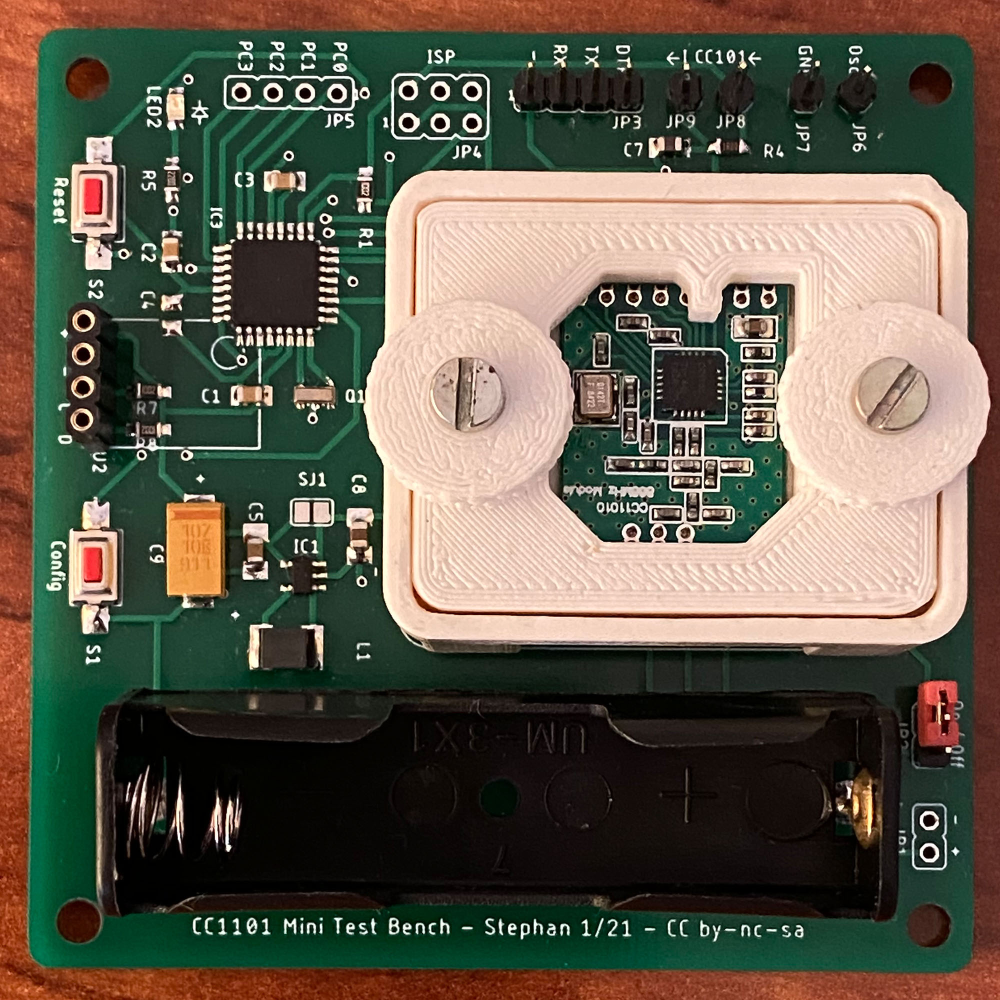

# CC1101Mini Testbench

In ganz enger Anlehnung an das [Projekt von Tom Major](https://homematic-forum.de/forum/viewtopic.php?f=76&t=54701) wurde eine abgespeckte Testbench entwickelt, die ohne Arduino Pro Mini arbeitet.

Features:
- optional Versorgung aus einer AA-Zelle
- Strommessung des CC1101-Moduls ueber externen oder optional bestueckbaren Shunt
- GDO0 auf Pin herausgefuehrt, um bei entsprechender CC1101-Config die Oszillatorfrequenz [mit einem Zaehler messen](https://homematic-forum.de/forum/viewtopic.php?f=76&t=54701&p=563047) zu koennen (Alternative zum [Frequenztest](https://asksinpp.de/Grundlagen/FAQ/Fehlerhafte_CC1101.html#ermittlung-der-cc1101-frequenz) oder Frequenzabschaetzung mit HF-Empfaenger/SDR)

## Lizenz

Creative Commons BY-NC-SA
