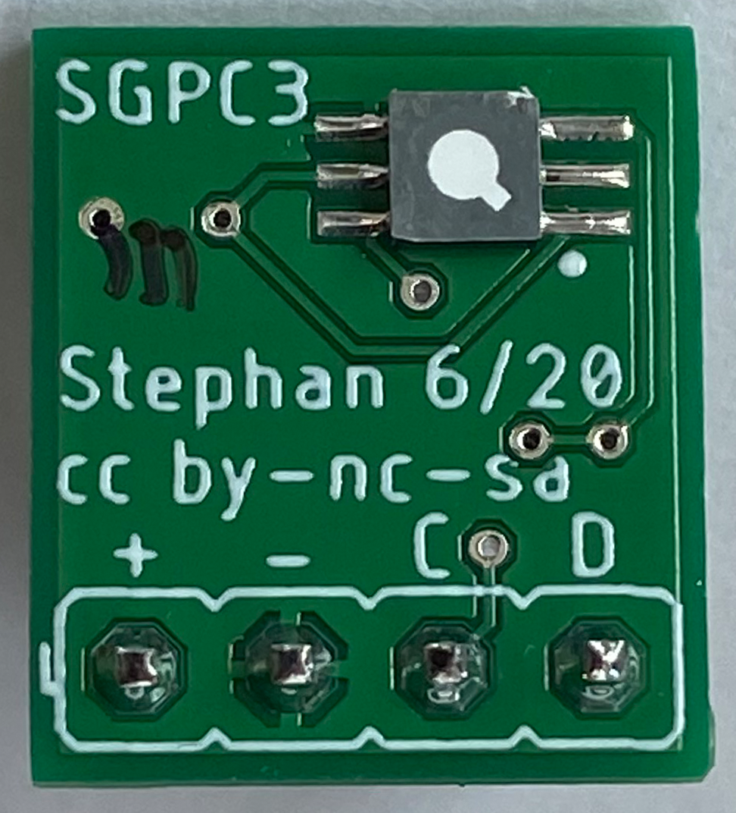
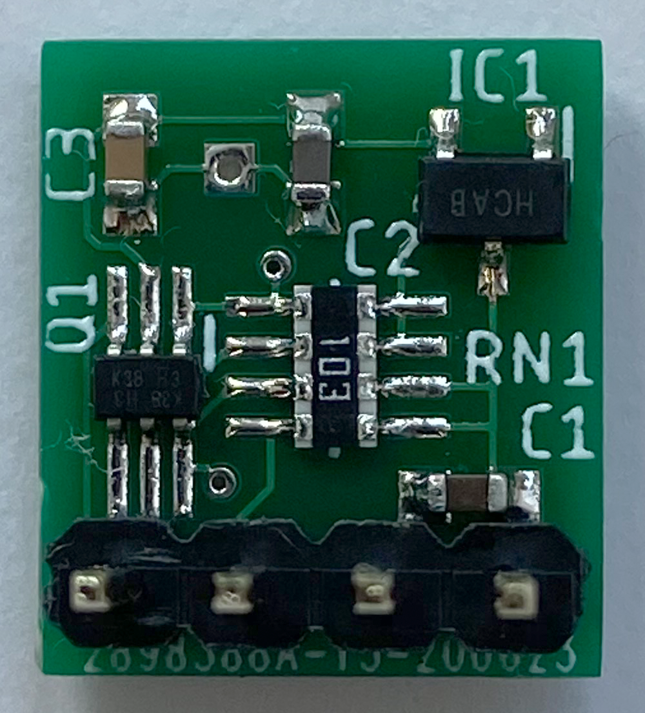

# SGPC3 Breakout Board

Ein Breakout Board fuer den Sensirion TVOC-Sensor [SGPC3](https://www.sensirion.com/fileadmin/user_upload/customers/sensirion/Dokumente/9_Gas_Sensors/Datasheets/Sensirion_Gas_Sensors_SGPC3_Datasheet.pdf).
Im Vergleich zum verbreiteten SGP30 ist dieser Sensor fuer Batteriebetrieb vorgesehen und auch die Wahl des LDO-Reglers folgt diesem Zweck.

Die Gerber-Files werden bspw. von [JLCPCB](https://jlcpcb.com/) anstandslos verarbeitet.

Die Pads sind (ueber)gross gestaltet, um ein Loeten per Hand zu ermoeglichen. Unter dem Mikroskop ist dies voellig unkritisch, mit guten Augen vermutlich auch mit starker Brille.

## Prototyp

## Hardware

Aus Platzgruenden wurde Bauform 0603 fuer die Kondensatoren genutzt. Der Spannungsregler MCP1702 wurde wegen des geringen Ruhestromes von 2uA ausgewaehlt und ist nur als SOT23 verfuegbar. Levelshifting wurde mittels Dual-FET BSS138DW im SOT363-Gehaeuse und Widerstandsarray (4 x 0603) geloest. Beim Aufbau bietet sich eine gruendliche Waesche nach Bestueckung aller Bauteile ausser dem SGPC3 an, da dieser eine Waesche nicht vertraegt, jedoch insb. bei einem VOC-Sensor moeglichst wenige fluechtige organische Rueckstaende auf der Platine vorhanden sein sollten. Beim Handloeten sollte entsprechend fuer den Sensor die minimal moegliche Flussmittelmenge genutzt werden. 

## Softwareeinbindung fuer AskSinPP Devices

Fuer die Nutzung in einem AskSinPP-Device findet sich die passende Bibliothek und eine prototypische Implementierung in meinem Projekt [HB-UNI-Sen-IAQ-Test-2](https://github.com/HMSteve/HB-UNI-Sen-IAQ-Test-2)

## Lizenz

Creative Commons BY-NC-SA
